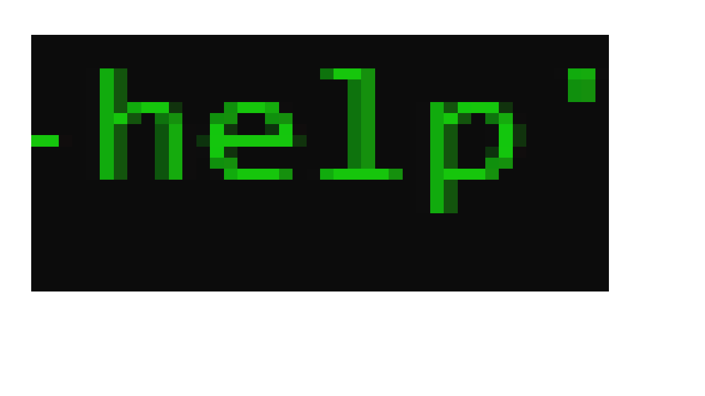

# Git Test
## Something
```bash
kdlfkdl
cd what
"ahaha"
```
## Git Projekt or something 
```bash

E:\GitTestSem>git config --global user.name "shahdlala"

E:\GitTestSem> git config --global user.email "s.lala@hgs-singen.com"


E:\GitTestSem>git init
Initialized empty Git repository in E:/GitTestSem/.git/

git 
git test>dir
git code .

E:\GitTestSem>git add Readme.md

E:\GitTestSem>git status
On branch master

No commits yet

Untracked files:
  (use "git add <file>..." to include in what will be committed)
        git
        readme.md

nothing added to commit but untracked files present (use "git add" to track)

E:\GitTestSem>git add git

E:\GitTestSem>git add readme.md

E:\GitTestSem>git status
On branch master

No commits yet

Changes to be committed:
  (use "git rm --cached <file>..." to unstage)
        new file:   git
        new file:   readme.md


E:\GitTestSem>


```
## Bransh
````bash
E:\GitTestSem>git branch
* master

E:\GitTestSem>git branch -m "main"

E:\GitTestSem>git branch
* main

E:\GitTestSem>
````
## Bilder


````bash

Video für das ganze ding 'git in 40 min'
````
## Remote
````bash
E:\GitTestSem>git push
fatal: The current branch main has no upstream branch.
To push the current branch and set the remote as upstream, use

    git push --set-upstream origin main


E:\GitTestSem>git push --set-upstream origin main
Enumerating objects: 11, done.
Counting objects: 100% (11/11), done.
Delta compression using up to 4 threads
Compressing objects: 100% (10/10), done.
Writing objects: 100% (11/11), 5.85 KiB | 5.85 MiB/s, done.
Total 11 (delta 1), reused 0 (delta 0), pack-reused 0
remote: Resolving deltas: 100% (1/1), done.
To https://github.com/ShahdLala/GitTest.git
 * [new branch]      main -> main
Branch 'main' set up to track remote branch 'main' from 'origin'.

E:\GitTestSem>git push
Everything up-to-date

E:\GitTestSem>git status
On branch main
Your branch is up to date with 'origin/main'.

nothing to commit, working tree clean

E:\GitTestSem>
````


